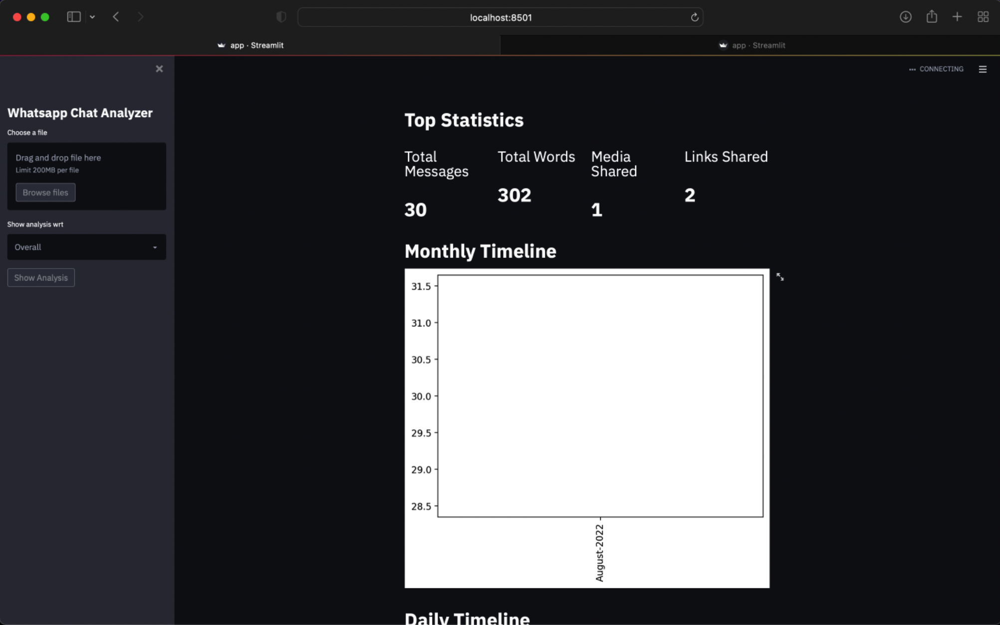
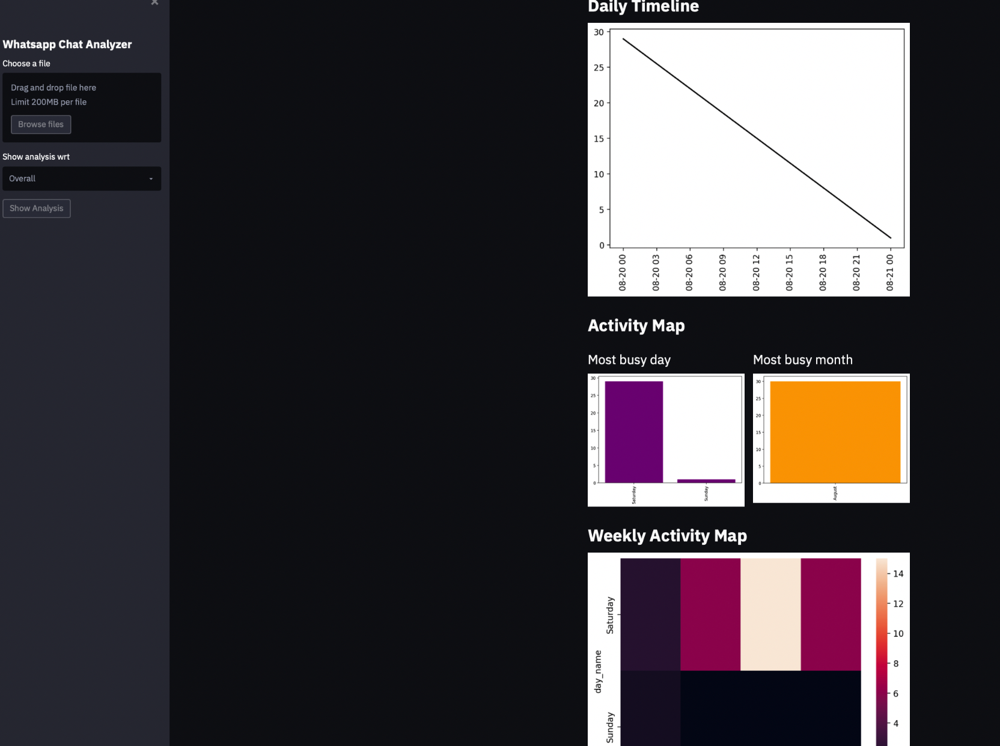

# whatsapp-chat-analysis
A streamlit app to analyze your whatsapp chats

*Steps to Get Your Personal WHATSAPP CHAT history:*

1.Open whatsapp in your mobile.
2. Go to that group or personal chat whose chat details you want to extract.
3. Click on the 3 dot icon(upper right) and go to more options.
4. Choose ‘export chat’ and select without media option.

Now you have the dataset as 'txt' , upload it.

